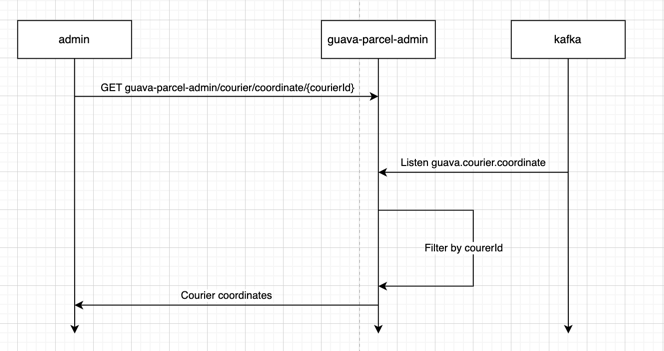
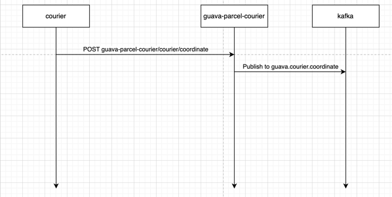

### Guava task
Microservices system for order delivery.

### Architecture schema

### Deployment instructions

In the root directory of project run

<code> docker-compose up -f docker/guava.yaml </code>

### OpenAPI
<code>openapi/openapi.yaml</code>

### Courier coordinate listen flow

### Courier coordinate produce flow
